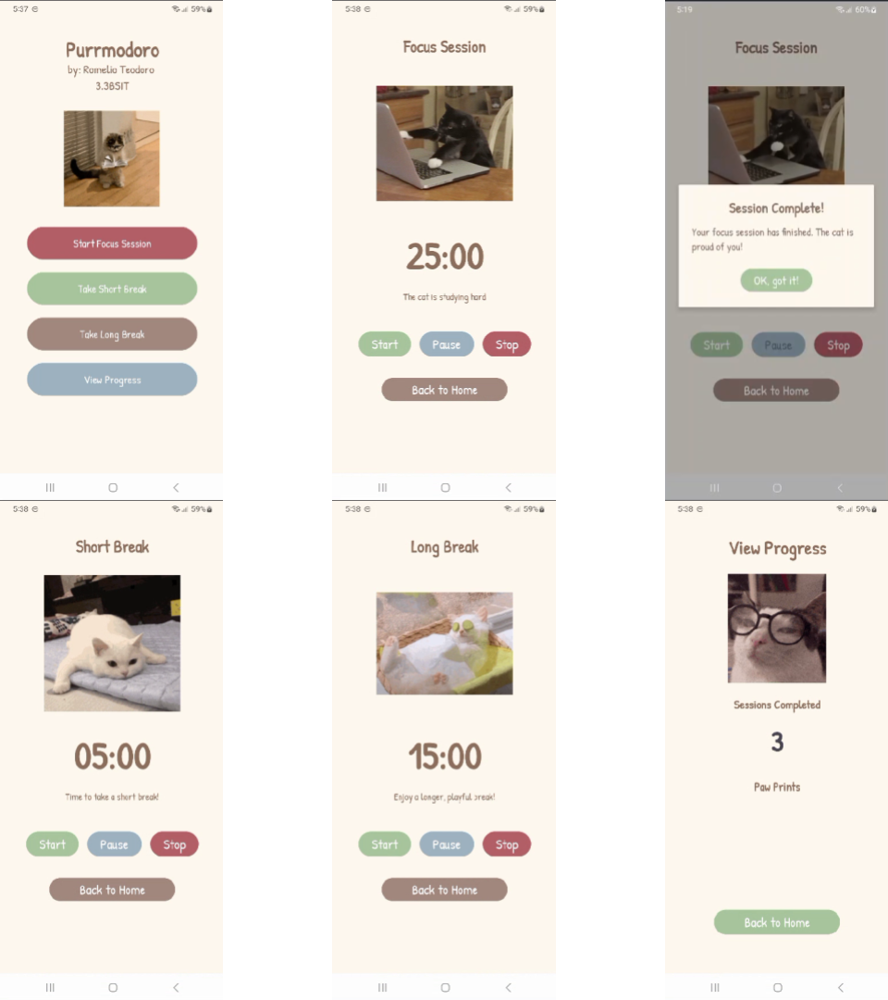

# Purrmodoro

A cozy, cat-themed Pomodoro timer to help you stay focused and take regular breaks while studying or working.

This app was created as the **final project** for a **Mobile Development** course.



---

## Features

- **Pomodoro-style timer**: Alternate between focused work sessions and short breaks.

- **Clear visual feedback**: Simple UI that makes it easy to see whether you’re in a focus or break period.
- **Sound alert**: An alarm sound plays at the end of each session so you don’t miss the transition.
- **Cat-themed experience**: A playful, relaxing aesthetic to make productivity feel a bit more purr-sonal.


## Getting Started

- **Requirements**
  - **Android Studio** (Giraffe or newer recommended)
  - **JDK 11**
  - **Android device or emulator** running **Android 7.0 (API 24)** or higher

- **Cloning the project**

```bash
git clone git@github.com:melio0504/purrmodoro.git
cd purrmodoro
```

- **Opening in Android Studio**
  - **File → Open…**, then select the `purrmodoro` project directory.
  - Let Gradle sync and finish indexing.

- **Running the app**
  - Connect an Android device with USB debugging enabled **or** start an Android emulator.
  - In Android Studio, select the desired run configuration.
  - Click **Run ▶** to build and install the app.

### Tech Stack

- **Platform**: Native Android app
- **Language**: Java 11
- **Build System**: Gradle with Android Gradle Plugin `8.12.3`
- **UI / Libraries**:
  - `androidx.appcompat:appcompat`
  - `com.google.android.material:material`
  - `androidx.activity:activity`
  - `androidx.constraintlayout:constraintlayout`
  - `com.github.bumptech.glide:glide`
- **Testing**:
  - JUnit 4
  - AndroidX Test JUnit
  - Espresso 
